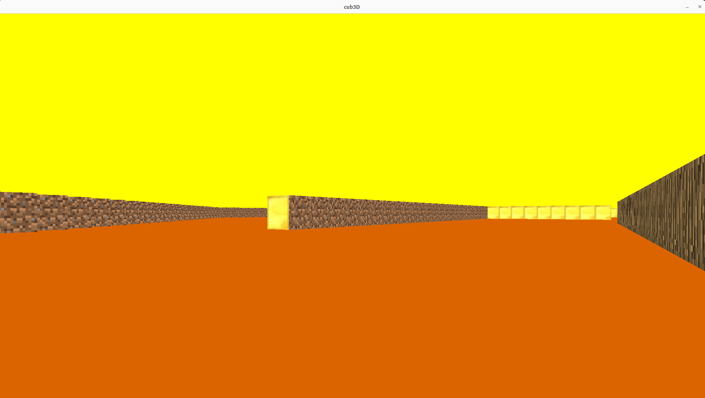

# Cub3D
<a name="readme-top"></a>


<!-- ABOUT THE PROJECT -->
## About The Project

A 3D fps where you can move around using ray-casting

### Built With


## Geting Started
to create the binary file:
```sh
make
```
to try it:
```sh
./cub3D maps/map_of_your_choice.cub
```

## Scene Example
